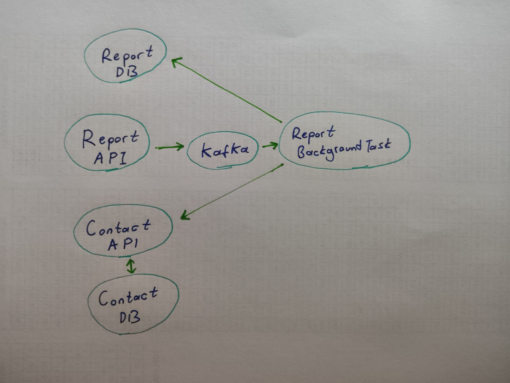

Contact Api: http://localhost:8000/swagger/index.html

Report Api: http://localhost:8001/swagger/index.html

Kafka Ui or Adminer: http://localhost:8080/ (Doesn't work together, both wants the same port insistently)

- [x] 7 Containers (2 Api, 1 Background Service, 1 Kafka, 1 Kafka Ui, 1 Adminer, 1 Postgres)
- [x] 27 Tests

Containers And The Flow
-------------------
